# termaid Gallery

Auto-generated visual reference of all supported diagram fixtures.
Total: 78 diagrams.

## blockdiagram

### basic

**Input:**
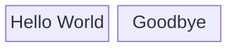

**Output:**
```


  ┌─────────────┐    ┌──────────┐
  │             │    │          │
  │ Hello World │    │ Goodbye  │
  │             │    │          │
  └─────────────┘    └──────────┘
```

### col_span

**Input:**
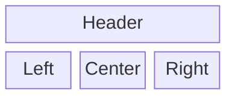

**Output:**
```


  ┌──────────────────────────────────────────┐
  │                                          │
  │                  Header                  │
  │                                          │
  └──────────────────────────────────────────┘


  ┌──────────┐    ┌──────────┐    ┌──────────┐
  │          │    │          │    │          │
  │   Left   │    │  Center  │    │  Right   │
  │          │    │          │    │          │
  └──────────┘    └──────────┘    └──────────┘
```

### grid

**Input:**
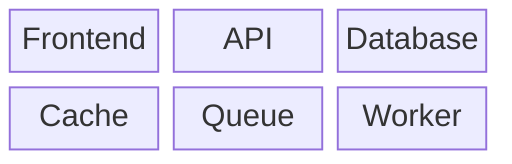

**Output:**
```


  ┌──────────┐    ┌──────────┐    ┌──────────┐
  │          │    │          │    │          │
  │ Frontend │    │   API    │    │ Database │
  │          │    │          │    │          │
  └──────────┘    └──────────┘    └──────────┘


  ┌──────────┐    ┌──────────┐    ┌──────────┐
  │          │    │          │    │          │
  │  Cache   │    │  Queue   │    │  Worker  │
  │          │    │          │    │          │
  └──────────┘    └──────────┘    └──────────┘
```

### links

**Input:**
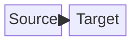

**Output:**
```


  ┌──────────┐    ┌──────────┐
  │          │    │          │
  │  Source  │───►│  Target  │
  │          │    │          │
  └──────────┘    └──────────┘
```

## classdiagram

### annotation

**Input:**
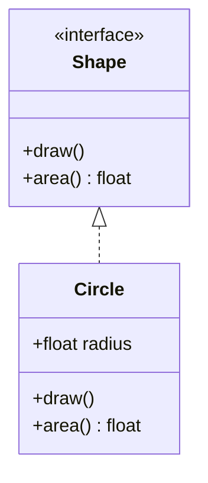

**Output:**
```


  ┌───────────────┐
  │  «interface»  │
  │     Shape     │
  ├───────────────┤
  │ +draw()       │
  │ +area() float │
  └───────────────┘
          △
          ┆
          ┆
          ┆
  ┌───────────────┐
  │    Circle     │
  ├───────────────┤
  │ +float radius │
  ├───────────────┤
  │ +draw()       │
  │ +area() float │
  └───────────────┘
```

### basic

**Input:**
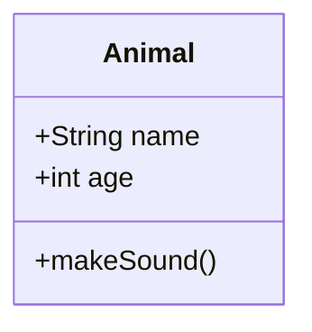

**Output:**
```


  ┌──────────────┐
  │    Animal    │
  ├──────────────┤
  │ +String name │
  │ +int age     │
  ├──────────────┤
  │ +makeSound() │
  └──────────────┘
```

### inheritance

**Input:**
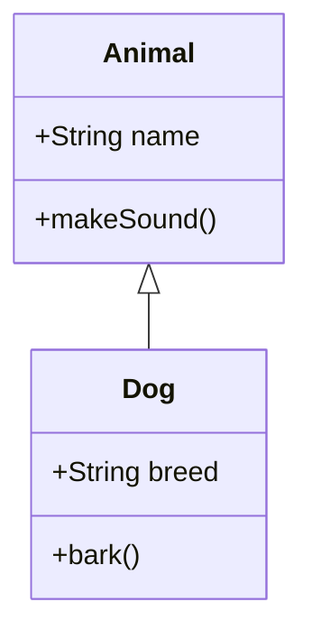

**Output:**
```


  ┌──────────────┐
  │    Animal    │
  ├──────────────┤
  │ +String name │
  ├──────────────┤
  │ +makeSound() │
  └──────────────┘
          △
          │
          │
          │
  ┌───────────────┐
  │      Dog      │
  ├───────────────┤
  │ +String breed │
  ├───────────────┤
  │ +bark()       │
  └───────────────┘
```

### relationships

**Input:**
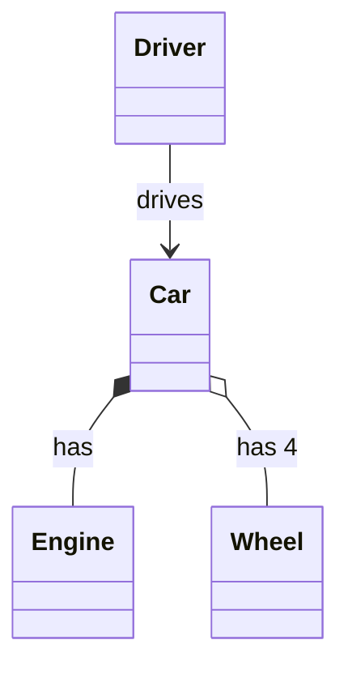

**Output:**
```


            ┌──────────────┐
            │    Driver    │
            └──────────────┘
                    │
                    │ drives
                    │
                    ▼
            ┌──────────────┐
            │     Car      │
            └──────────────┘
                   ◆ ◇
          ┼─────has┼ ┼─────has┼4
          │                   │
          │                   │
  ┌──────────────┐    ┌──────────────┐
  │    Engine    │    │    Wheel     │
  └──────────────┘    └──────────────┘
```

## erdiagram

### attributes

**Input:**
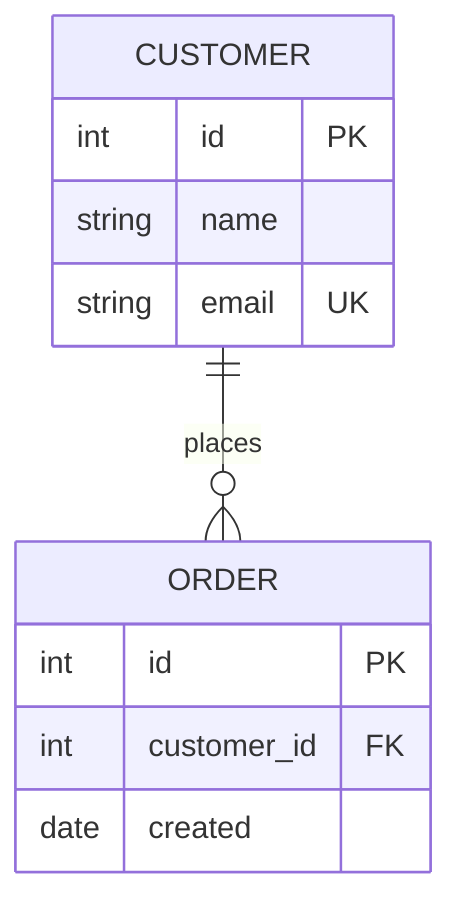

**Output:**
```


   ┌──────────────────┐
   │     CUSTOMER     │
   ├──────────────────┤
   │ int id  PK       │
   │ string name      │
   │ string email  UK │
   └──────────────────┘
             │1
             │ places
             │
             │0..*
  ┌─────────────────────┐
  │        ORDER        │
  ├─────────────────────┤
  │ int id  PK          │
  │ int customer_id  FK │
  │ date created        │
  └─────────────────────┘
```

### basic

**Input:**
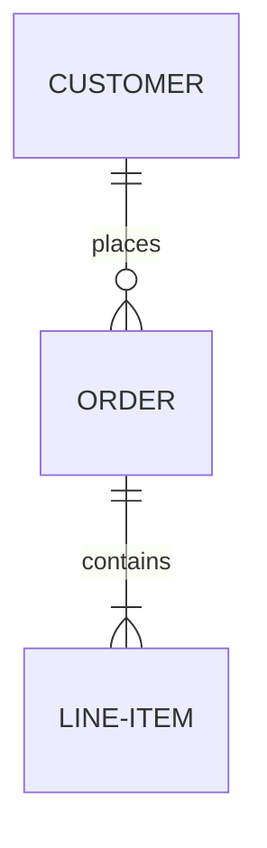

**Output:**
```


  ┌──────────────┐
  │   CUSTOMER   │
  └──────────────┘
          │1
          │ places
          │
          │0..*
  ┌──────────────┐
  │    ORDER     │
  └──────────────┘
          │1
          │ contains
          │
          │1..*
  ┌──────────────┐
  │  LINE-ITEM   │
  └──────────────┘
```

### dashed

**Input:**
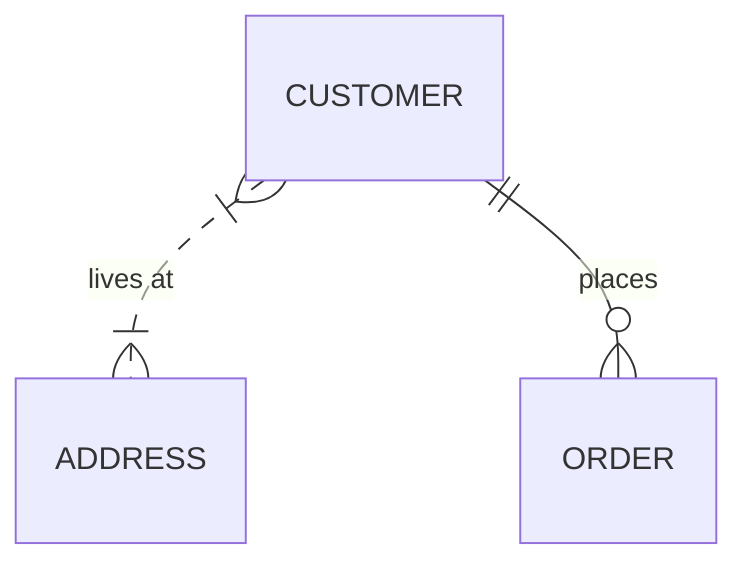

**Output:**
```


            ┌──────────────┐
            │   CUSTOMER   │
            └──────────────┘
                   ┆1│1*
          ┼┄┄┄┄┄┄┄┄┼ ┼─places─┼
          ┆                   │
          ┆1..*               │0..*
  ┌──────────────┐    ┌──────────────┐
  │   ADDRESS    │    │    ORDER     │
  └──────────────┘    └──────────────┘
```

### multiple_entities

**Input:**
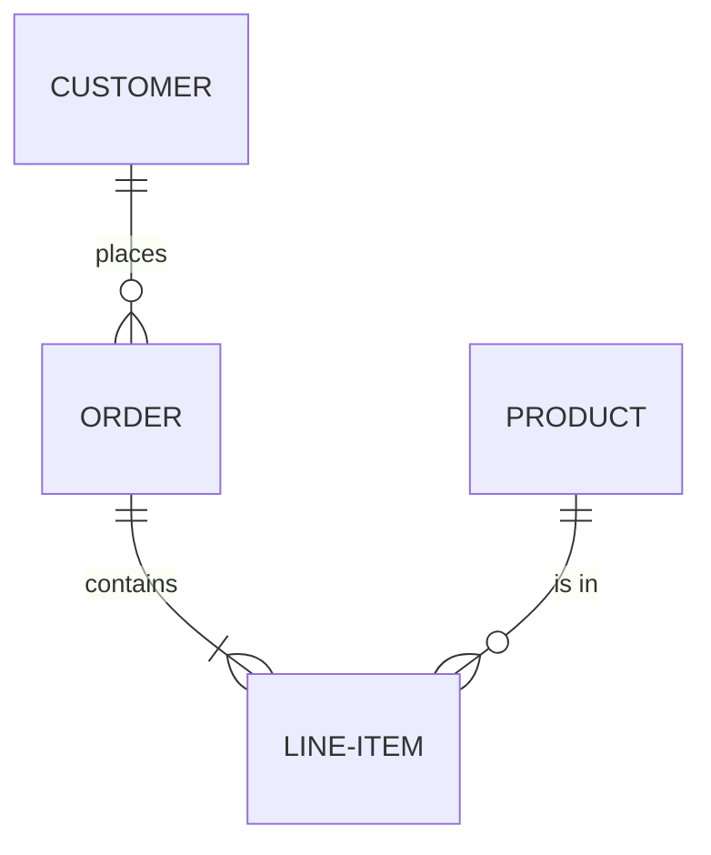

**Output:**
```


      ┌──────────────┐    ┌──────────────┐
      │   CUSTOMER   │    │   PRODUCT    │
      └──────────────┘    └──────────────┘
              │1                  │1
          ┼───┼ places            ┼─is┼in
          │                           │
          │0..*                       │0..*
  ┌──────────────┐ 1     1..* ┌──────────────┐
  │    ORDER     │────────────│  LINE-ITEM   │
  └──────────────┘ contains   └──────────────┘
```

## flowcharts

### all_shapes

**Input:**
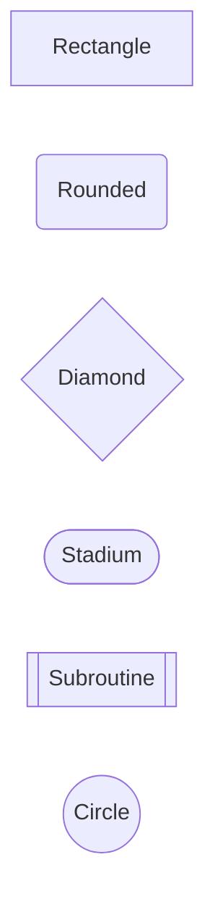

**Output:**
```
┌──────────────┐
│              │
│  Rectangle   │
│              │
└──────────────┘


╭──────────────╮
│              │
│   Rounded    │
│              │
╰──────────────╯


┌───────◇──────┐
│              │
│   Diamond    │
│              │
└───────◇──────┘


╭──────────────╮
(              )
(   Stadium    )
(              )
╰──────────────╯


┌──────────────┐
││            ││
││ Subroutine ││
││            ││
└──────────────┘


╭───────◯──────╮
│              │
│    Circle    │
│              │
╰───────◯──────╯
```

### ampersand_both

**Input:**
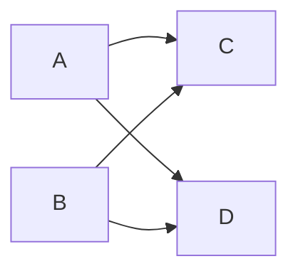

**Output:**
```
┌─────┐        ┌─────┐
│     │        │     │
│  A  ├──┬───┬►│  C  │
│     │  │   │ │     │
└─────┘  │   │ └─────┘
         │   │
         │   │
         │   │
┌─────┐  │   │ ┌─────┐
│     │  ├───┼►│     │
│  B  ┼──────╯ │  D  │
│     ├───────►│     │
└─────┘        └─────┘
```

### backlink_complex

**Input:**
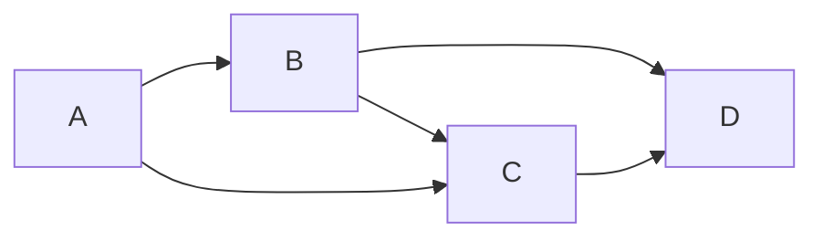

**Output:**
```
┌─────┐    ┌─────┐    ┌─────┐
│     │    │     │    │     │
│  A  ├──┬►│  B  ├──┬►│  D  │
│     │  │ │     │  │ │     │
└─────┘  │ └──┬──┘  │ └─────┘
         │    │     │
         │    │     │
         │    ▼     │
         │ ┌─────┐  │
         │ │     │  │
         ╰►│  C  ├──╯
           │     │
           └─────┘
```

### bidir_dotted

**Input:**
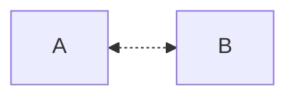

**Output:**
```
┌─────┐    ┌─────┐
│     │    │     │
│  A  │◄┄┄►│  B  │
│     │    │     │
└─────┘    └─────┘
```

### bidir_labeled

**Input:**
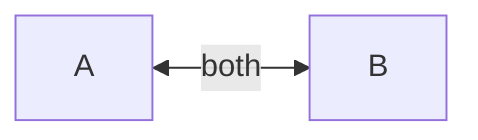

**Output:**
```
┌─────┐     ┌─────┐
│     │both │     │
│  A  │◄───►│  B  │
│     │     │     │
└─────┘     └─────┘
```

### bidir_td

**Input:**
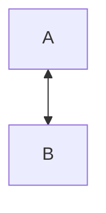

**Output:**
```
┌─────┐
│     │
│  A  │
│     │
└─────┘
   ▲
   │
   ▼
┌─────┐
│     │
│  B  │
│     │
└─────┘
```

### bidir_thick

**Input:**
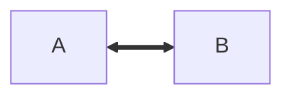

**Output:**
```
┌─────┐    ┌─────┐
│     │    │     │
│  A  │◄━━►│  B  │
│     │    │     │
└─────┘    └─────┘
```

### bidirectional

**Input:**
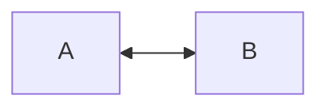

**Output:**
```
┌─────┐    ┌─────┐
│     │    │     │
│  A  │◄──►│  B  │
│     │    │     │
└─────┘    └─────┘
```

### branching

**Input:**
```mermaid
graph LR
    A --> B & C
```

**Output:**
```
┌─────┐    ┌─────┐
│     │    │     │
│  A  ├──┬►│  B  │
│     │  │ │     │
└─────┘  │ └─────┘
         │
         │
         │
         │ ┌─────┐
         │ │     │
         ╰►│  C  │
           │     │
           └─────┘
```

### chain

**Input:**
```mermaid
graph LR
    A --> B --> C --> D --> E
```

**Output:**
```
┌─────┐    ┌─────┐    ┌─────┐    ┌─────┐    ┌─────┐
│     │    │     │    │     │    │     │    │     │
│  A  ├───►│  B  ├───►│  C  ├───►│  D  ├───►│  E  │
│     │    │     │    │     │    │     │    │     │
└─────┘    └─────┘    └─────┘    └─────┘    └─────┘
```

### comments

**Input:**
```mermaid
graph LR
    %% This is a comment
    A --> B
    %% Another comment
    B --> C
```

**Output:**
```
┌─────┐    ┌─────┐    ┌─────┐
│     │    │     │    │     │
│  A  ├───►│  B  ├───►│  C  │
│     │    │     │    │     │
└─────┘    └─────┘    └─────┘
```

### cycle

**Input:**
```mermaid
graph LR
    A --> B --> C --> A
```

**Output:**
```
┌─────┐    ┌─────┐    ┌─────┐
│     │    │     │    │     │
│  A  ├───►│  B  ├───►│  C  │
│     │    │     │    │     │
└─────┘    └─────┘    └──┬──┘
   ▲                     │
   ╰─────────────────────╯
```

### diamond

**Input:**
```mermaid
graph TD
    A[Start] --> B{Is it?}
    B -->|Yes| C[OK]
    B -->|No| D[End]
```

**Output:**
```
┌──────────┐
│          │
│  Start   │
│          │
└─────┬────┘
      │
      │
      ▼
┌─────◇────┐
│          │
│  Is it?  │
│          │
└─────◇────┘
      │
      │
      ├───────────────╮No
   Yes│               │
      ▼               ▼
┌──────────┐    ┌──────────┐
│          │    │          │
│    OK    │    │   End    │
│          │    │          │
└──────────┘    └──────────┘
```

### dotted_arrow

**Input:**
```mermaid
graph LR
    A -.-> B
```

**Output:**
```
┌─────┐    ┌─────┐
│     │    │     │
│  A  ├┄┄┄►│  B  │
│     │    │     │
└─────┘    └─────┘
```

### duplicate_labels

**Input:**
```mermaid
graph TD
    A[Server] --> B[Client]
    C[Server] --> D[Client]
```

**Output:**
```
┌──────────┐    ┌──────────┐
│          │    │          │
│  Server  │    │  Server  │
│          │    │          │
└─────┬────┘    └─────┬────┘
      │               │
      │               │
      ▼               ▼
┌──────────┐    ┌──────────┐
│          │    │          │
│  Client  │    │  Client  │
│          │    │          │
└──────────┘    └──────────┘
```

### empty_graph

**Input:**
```mermaid
graph LR
    A
```

**Output:**
```
┌─────┐
│     │
│  A  │
│     │
└─────┘
```

### fan_in

**Input:**
```mermaid
graph TD
    A & B & C --> D
```

**Output:**
```
┌─────┐    ┌─────┐    ┌─────┐
│     │    │     │    │     │
│  A  │    │  B  │    │  C  │
│     │    │     │    │     │
└┬────┘    └──┬──┘    └──┬──┘
 │            │          │
 │   ╭────────┼──────────╯
 │   │        │
 │   │        │
 │ ╭─┼────────╯
 ▼ ▼ ▼
┌─────┐
│     │
│  D  │
│     │
└─────┘
```

### fan_out

**Input:**
```mermaid
graph TD
    A --> B & C & D
```

**Output:**
```
┌─────┐
│     │
│  A  │
│     │
└──┬──┘
   │
   ├──────────╮
   │          │
   │          │
   ├──────────┼──────────╮
   ▼          ▼          ▼
┌─────┐    ┌─────┐    ┌─────┐
│     │    │     │    │     │
│  B  │    │  C  │    │  D  │
│     │    │     │    │     │
└─────┘    └─────┘    └─────┘
```

### flowchart_keyword

**Input:**
```mermaid
flowchart LR
    A --> B
    B --> C
```

**Output:**
```
┌─────┐    ┌─────┐    ┌─────┐
│     │    │     │    │     │
│  A  ├───►│  B  ├───►│  C  │
│     │    │     │    │     │
└─────┘    └─────┘    └─────┘
```

### graph_bt

**Input:**
```mermaid
graph BT
    A --> B --> C
```

**Output:**
```


┌─────┐
│     │
│  C  │
│     │
└─────┘
   ▲
   │
   │
┌──┴──┐
│     │
│  B  │
│     │
└─────┘
   ▲
   │
   │
┌──┴──┐
│     │
│  A  │
│     │
└─────┘
```

### graph_rl

**Input:**
```mermaid
graph RL
    A --> B --> C
```

**Output:**
```
    ┌─────┐    ┌─────┐    ┌─────┐
    │     │    │     │    │     │
    │  C  │◄───┤  B  │◄───┤  A  │
    │     │    │     │    │     │
    └─────┘    └─────┘    └─────┘
```

### labeled_edges

**Input:**
```mermaid
graph LR
    A -->|yes| B
    A -->|no| C
```

**Output:**
```
┌─────┐    ┌─────┐
│     │yes │     │
│  A  ├──┬►│  B  │
│     │  │ │     │
└─────┘  │ └─────┘
         │
         │no
         │
         │ ┌─────┐
         │ │     │
         ╰►│  C  │
           │     │
           └─────┘
```

### large_graph

**Input:**
```mermaid
graph TD
    A[Start] --> B[Process 1]
    A --> C[Process 2]
    B --> D[Check 1]
    B --> E[Check 2]
    C --> F[Check 3]
    C --> G[Check 4]
    D --> H[Result 1]
    E --> H
    F --> I[Result 2]
    G --> I
    H --> J[Merge]
    I --> J
    J --> K[Output 1]
    J --> L[Output 2]
    K --> M[End]
    L --> M
```

**Output:**
```
┌─────────────┐
│             │
│    Start    │
│             │
└──────┬──────┘
       │
       ├──────────────────╮
       ▼                  ▼
┌─────────────┐    ┌─────────────┐
│             │    │             │
│  Process 1  │    │  Process 2  │
│             │    │             │
└──────┬──────┘    └──────┬──────┘
       │                  │
       ├──────────────────┼──────────────────╮
       │                  │                  │
       │                  │                  │
       │                  ├──────────────────┼──────────────────╮
       │                  │                  │                  │
       │                  │                  │                  │
       │                  │                  │                  │
       ▼                  ▼                  ▼                  ▼
┌─────────────┐    ┌─────────────┐    ┌─────────────┐    ┌─────────────┐
│             │    │             │    │             │    │             │
│   Check 1   │    │   Check 2   │    │   Check 3   │    │   Check 4   │
│             │    │             │    │             │    │             │
└─────┬───────┘    └──────┬──────┘    └──────┬──────┘    └──────┬──────┘
      │                   │                  │                  │
      │                   │                  │                  │
      │                   │                  │                  │
      │                   │                  │                  │
      │                   │╭─────────────────┼──────────────────╯
      │                   ││                 │
      │                   ││                 │
      │ ╭────────────────┬┴┼─────────────────╯
      ▼ ▼                ▼ ▼
┌─────────────┐    ┌─────────────┐
│             │    │             │
│  Result 1   │    │  Result 2   │
│             │    │             │
└─────┬───────┘    └──────┬──────┘
      │                   │
      │ ╭─────────────────╯
      ▼ ▼
┌─────────────┐
│             │
│    Merge    │
│             │
└──────┬──────┘
       │
       ├──────────────────╮
       ▼                  ▼
┌─────────────┐    ┌─────────────┐
│             │    │             │
│  Output 1   │    │  Output 2   │
│             │    │             │
└─────┬───────┘    └──────┬──────┘
      │                   │
      │ ╭─────────────────╯
      ▼ ▼
┌─────────────┐
│             │
│     End     │
│             │
└─────────────┘
```

### long_labels

**Input:**
```mermaid
graph LR
    A[This is a very long label that takes up space] --> B[Short]
```

**Output:**
```
┌───────────────────────┐    ┌─────────┐
│                       │    │         │
│  This is a very long  │    │         │
│  label that takes up  ├───►│  Short  │
│         space         │    │         │
│                       │    │         │
└───────────────────────┘    └─────────┘
```

### mermaid_comprehensive

**Input:**
```mermaid
flowchart LR
    A[Hard edge] -->|Link text| B(Round edge)
    B --> C{Decision}
    C -->|One| D[Result one]
    C -->|Two| E[Result two]
```

**Output:**
```
┌─────────────┐          ╭──────────────╮    ┌──────◇─────┐    ┌──────────────┐
│             │Link text │              │    │            │    │              │
│  Hard edge  ├─────────►│  Round edge  ├───►│  Decision  ├──┬►│  Result one  │
│             │          │              │    │            │One │              │
└─────────────┘          ╰──────────────╯    └──────◇─────┘  │ └──────────────┘
                                                             │
                                                             │Two
                                                             │
                                                             │ ┌──────────────┐
                                                             │ │              │
                                                             ╰►│  Result two  │
                                                               │              │
                                                               └──────────────┘
```

### mixed_arrow_styles

**Input:**
```mermaid
graph LR
    A --> B
    B -.-> C
    C ==> D
```

**Output:**
```
┌─────┐    ┌─────┐    ┌─────┐    ┌─────┐
│     │    │     │    │     │    │     │
│  A  ├───►│  B  ├┄┄┄►│  C  ├━━━►│  D  │
│     │    │     │    │     │    │     │
└─────┘    └─────┘    └─────┘    └─────┘
```

### multiple_links

**Input:**
```mermaid
graph LR
    A --> B & C & D
```

**Output:**
```
┌─────┐        ┌─────┐
│     │        │     │
│  A  ├──┬───┬►│  B  │
│     │  │   │ │     │
└─────┘  │   │ └─────┘
         │   │
         │   │
         │   │
         │   │ ┌─────┐
         │   │ │     │
         ╰───┼►│  C  │
             │ │     │
             │ └─────┘
             │
             │
             │
             │ ┌─────┐
             │ │     │
             ╰►│  D  │
               │     │
               └─────┘
```

### no_arrow_dotted

**Input:**
```mermaid
graph LR
    A -.- B
```

**Output:**
```
┌─────┐    ┌─────┐
│     │    │     │
│  A  ├┄┄┄┄┤  B  │
│     │    │     │
└─────┘    └─────┘
```

### no_arrow_solid

**Input:**
```mermaid
graph LR
    A --- B
```

**Output:**
```
┌─────┐    ┌─────┐
│     │    │     │
│  A  ├────┤  B  │
│     │    │     │
└─────┘    └─────┘
```

### no_arrow_thick

**Input:**
```mermaid
graph LR
    A === B
```

**Output:**
```
┌─────┐    ┌─────┐
│     │    │     │
│  A  ├━━━━┤  B  │
│     │    │     │
└─────┘    └─────┘
```

### node_with_label

**Input:**
```mermaid
graph LR
    A[Custom Label A] --> B[Custom Label B]
```

**Output:**
```
┌──────────────────┐    ┌──────────────────┐
│                  │    │                  │
│  Custom Label A  ├───►│  Custom Label B  │
│                  │    │                  │
└──────────────────┘    └──────────────────┘
```

### parallelogram

**Input:**
```mermaid
graph LR
    A[/Parallelogram/] --> B[\Alt Para\]
```

**Output:**
```
/─────────────────/    \────────────\
│                 │    │            │
│  Parallelogram  ├───►│  Alt Para  │
│                 │    │            │
/─────────────────/    \────────────\
```

### self_ref_with_edge

**Input:**
```mermaid
graph LR
    A --> A & B
```

**Output:**
```
┌─────┬──╮ ┌─────┐
│     │  │ │     │
│  A  ├◄─┴►│  B  │
│     │    │     │
└─────┘    └─────┘
```

### self_reference

**Input:**
```mermaid
graph LR
    A --> A
```

**Output:**
```
┌─────┬──╮
│     │  │
│  A  │◄─╯
│     │
└─────┘
```

### semicolons

**Input:**
```mermaid
graph LR
    A --> B; B --> C; C --> D
```

**Output:**
```
┌─────┐    ┌─────┐    ┌─────┐    ┌─────┐
│     │    │     │    │     │    │     │
│  A  ├───►│  B  ├───►│  C  ├───►│  D  │
│     │    │     │    │     │    │     │
└─────┘    └─────┘    └─────┘    └─────┘
```

### simple_lr

**Input:**
```mermaid
graph LR
    A --> B
```

**Output:**
```
┌─────┐    ┌─────┐
│     │    │     │
│  A  ├───►│  B  │
│     │    │     │
└─────┘    └─────┘
```

### simple_tb

**Input:**
```mermaid
graph TB
    A --> B
```

**Output:**
```
┌─────┐
│     │
│  A  │
│     │
└──┬──┘
   │
   │
   ▼
┌─────┐
│     │
│  B  │
│     │
└─────┘
```

### simple_td

**Input:**
```mermaid
graph TD
    A --> B
```

**Output:**
```
┌─────┐
│     │
│  A  │
│     │
└──┬──┘
   │
   │
   ▼
┌─────┐
│     │
│  B  │
│     │
└─────┘
```

### single_node

**Input:**
```mermaid
graph LR
    A[Single Node]
```

**Output:**
```
┌───────────────┐
│               │
│  Single Node  │
│               │
└───────────────┘
```

### subgraph_basic

**Input:**
```mermaid
graph LR
    subgraph one
        A --> B
    end
    C --> A
```

**Output:**
```

          ┌────────────────────┐
          │ one                │
          │                    │
          │                    │
┌─────┐   │ ┌─────┐    ┌─────┐ │
│     │   │ │     │    │     │ │
│  C  ├───┼►│  A  ├───►│  B  │ │
│     │   │ │     │    │     │ │
└─────┘   │ └─────┘    └─────┘ │
          │                    │
          └────────────────────┘
```

### subgraph_nested

**Input:**
```mermaid
graph LR
    subgraph outer
        subgraph inner
            A --> B
        end
        C
    end
    D --> A
```

**Output:**
```

 ┌───────────────────────────────────────┐
 │ outer                                 │
 │                                       │
 │                                       │
 │                ┌────────────────────┐ │
 │                │ inner              │ │
 │                │                    │ │
 │                │                    │ │
 │ ┌─────┐        │ ┌─────┐    ┌─────┐ │ │
 │ │     │        │ │     │    │     │ │ │
 │ │  C  │     ╭──┼►│  A  ├───►│  B  │ │ │
 │ │     │     │  │ │     │    │     │ │ │
 │ └─────┘     │  │ └─────┘    └─────┘ │ │
 │             │  │                    │ │
 │             │  └────────────────────┘ │
 │             │                         │
 └─────────────┼─────────────────────────┘
               │
               │
               │
               │
   ┌─────┐     │
   │     │     │
   │  D  ├─────╯
   │     │
   └─────┘
```

### subgraph_three_levels

**Input:**
```mermaid
graph LR
    subgraph level1
        subgraph level2
            subgraph level3
                A
            end
        end
    end
```

**Output:**
```

 ┌─────────────────┐
 │ level1          │
 │                 │
 │                 │
 │ ┌─────────────┐ │
 │ │ level2      │ │
 │ │             │ │
 │ │             │ │
 │ │ ┌─────────┐ │ │
 │ │ │ level3  │ │ │
 │ │ │         │ │ │
 │ │ │         │ │ │
 │ │ │ ┌─────┐ │ │ │
 │ │ │ │     │ │ │ │
 │ │ │ │  A  │ │ │ │
 │ │ │ │     │ │ │ │
 │ │ │ └─────┘ │ │ │
 │ │ │         │ │ │
 │ │ └─────────┘ │ │
 │ │             │ │
 │ └─────────────┘ │
 │                 │
 └─────────────────┘
```

### subgraph_two_separate

**Input:**
```mermaid
graph LR
    subgraph Frontend
        UI
    end
    subgraph Backend
        API
    end
    UI --> API
```

**Output:**
```

 ┌──────────┐      ┌───────────┐
 │ Frontend │      │ Backend   │
 │          │      │           │
 │          │      │           │
 │ ┌──────┐ │      │ ┌───────┐ │
 │ │      │ │      │ │       │ │
 │ │  UI  ├─┼──────┼►│  API  │ │
 │ │      │ │      │ │       │ │
 │ └──────┘ │      │ └───────┘ │
 │          │      │           │
 └──────────┘      └───────────┘
```

### subgraph_with_labels

**Input:**
```mermaid
graph LR
    subgraph one
        A -->|sends| B
    end
    subgraph two
        C -->|receives| D
    end
    B -->|data| C
```

**Output:**
```

 ┌──────────────────────┐      ┌─────────────────────────┐
 │ one                  │      │ two                     │
 │                      │      │                         │
 │                      │      │                         │
 │ ┌─────┐      ┌─────┐ │      │ ┌─────┐         ┌─────┐ │
 │ │     │sends │     │ │      │ │data │         │     │ │
 │ │  A  ├─────►│  B  ├─┼──────┼►│  C  ├────────►│  D  │ │
 │ │     │      │     │ │      │ │     │receives │     │ │
 │ └─────┘      └─────┘ │      │ └─────┘         └─────┘ │
 │                      │      │                         │
 └──────────────────────┘      └─────────────────────────┘
```

### thick_arrow

**Input:**
```mermaid
graph LR
    A ==> B
```

**Output:**
```
┌─────┐    ┌─────┐
│     │    │     │
│  A  ├━━━►│  B  │
│     │    │     │
└─────┘    └─────┘
```

### three_nodes_inline

**Input:**
```mermaid
graph LR
    A --> B --> C
```

**Output:**
```
┌─────┐    ┌─────┐    ┌─────┐
│     │    │     │    │     │
│  A  ├───►│  B  ├───►│  C  │
│     │    │     │    │     │
└─────┘    └─────┘    └─────┘
```

### trapezoid

**Input:**
```mermaid
graph LR
    A[/Trapezoid/] --> B[\Alt Trap\]
```

**Output:**
```
/─────────────/    \────────────\
│             │    │            │
│  Trapezoid  ├───►│  Alt Trap  │
│             │    │            │
/─────────────/    \────────────\
```

### two_roots

**Input:**
```mermaid
graph LR
    A --> B
    C --> D
```

**Output:**
```
┌─────┐    ┌─────┐
│     │    │     │
│  A  ├───►│  B  │
│     │    │     │
└─────┘    └─────┘


┌─────┐    ┌─────┐
│     │    │     │
│  C  ├───►│  D  │
│     │    │     │
└─────┘    └─────┘
```

### unicode_labels

**Input:**
```mermaid
graph LR
    A["Hello ❤ World"] --> B["日本語"]
```

**Output:**
```
┌─────────────────┐    ┌──────────┐
│                 │    │          │
│  Hello ❤ World  ├───►│  日本語  │
│                 │    │          │
└─────────────────┘    └──────────┘
```

## gitgraph

### cherry_pick

**Input:**
```mermaid
gitGraph
    commit id: "A"
    branch develop
    commit id: "B"
    checkout main
    cherry-pick id: "B"
```

**Output:**
```


  main    ──●─────┼──────●─
            A     │  B-cherry
                  │      │
  develop         ●──────┼
                  B
```

### feature_branch

**Input:**
```mermaid
gitGraph
    commit id: "1"
    commit id: "2"
    branch develop
    commit id: "3"
    commit id: "4"
    checkout main
    commit id: "5"
    merge develop id: "6"
```

**Output:**
```


  main    ──●─────●─────┼───────────●─────●─
            1     2     │           5     6
                        │                 │
  develop               ●─────●───────────┼
                        3     4
```

### linear

**Input:**
```mermaid
gitGraph
    commit id: "init"
    commit id: "feat"
    commit id: "fix"
```

**Output:**
```


  main ───●─────●─────●─
        init  feat   fix
```

### tags

**Input:**
```mermaid
gitGraph
    commit id: "init" tag: "v0.1"
    commit id: "feat"
    commit id: "release" tag: "v1.0"
```

**Output:**
```

        [v0.1]         [v1.0]
  main ────●──────●───────●─
         init   feat   release
```

### tb_direction

**Input:**
```mermaid
gitGraph TB:
    commit id: "1"
    branch develop
    commit id: "2"
    checkout main
    commit id: "3"
    merge develop
```

**Output:**
```


main      develop
  │
  ●
  1
  │
  │
  ┼──────────●
  │          2
  │          │
  │          │
  ●          │
  3          │
  │          │
  │          │
  ●──────────┼
  0
```

## sequence

### arrows

**Input:**
```mermaid
sequenceDiagram
    A->>B: solid arrow
    A-->>B: dotted arrow
    A->B: solid open
    A-->B: dotted open
    A-xB: solid cross
    A-)B: solid async
```

**Output:**
```
 ┌──────────┐      ┌──────────┐
 │    A     │      │    B     │
 └──────────┘      └──────────┘
       ┆ solid arrow     ┆
       ──────────────────►
       ┆ dotted arrow    ┆
       ┄┄┄┄┄┄┄┄┄┄┄┄┄┄┄┄┄┄►
       ┆ solid open      ┆
       ───────────────────
       ┆ dotted open     ┆
       ┄┄┄┄┄┄┄┄┄┄┄┄┄┄┄┄┄┄┄
       ┆ solid cross     ┆
       ──────────────────x
       ┆ solid async     ┆
       ──────────────────)
       ┆                 ┆
```

### autonumber

**Input:**
```mermaid
sequenceDiagram
    autonumber
    Alice->>Bob: Hello
    Bob->>Charlie: Forward
    Charlie-->>Bob: Reply
    Bob-->>Alice: Done
```

**Output:**
```
 ┌──────────┐    ┌──────────┐    ┌──────────┐
 │  Alice   │    │   Bob    │    │ Charlie  │
 └──────────┘    └──────────┘    └──────────┘
       ┆ 1: Hello      ┆               ┆
       ────────────────►               ┆
       ┆               ┆ 2: Forward    ┆
       ┆               ────────────────►
       ┆               ┆ 3: Reply      ┆
       ┆               ◄┄┄┄┄┄┄┄┄┄┄┄┄┄┄┄┄
       ┆ 4: Done       ┆               ┆
       ◄┄┄┄┄┄┄┄┄┄┄┄┄┄┄┄┄               ┆
       ┆               ┆               ┆
```

### basic

**Input:**
```mermaid
sequenceDiagram
    Alice->>Bob: Hello Bob
    Bob-->>Alice: Hi Alice
    Alice->>Bob: How are you?
    Bob-->>Alice: Great!
```

**Output:**
```
 ┌──────────┐      ┌──────────┐
 │  Alice   │      │   Bob    │
 └──────────┘      └──────────┘
       ┆ Hello Bob       ┆
       ──────────────────►
       ┆ Hi Alice        ┆
       ◄┄┄┄┄┄┄┄┄┄┄┄┄┄┄┄┄┄┄
       ┆ How are you?    ┆
       ──────────────────►
       ┆ Great!          ┆
       ◄┄┄┄┄┄┄┄┄┄┄┄┄┄┄┄┄┄┄
       ┆                 ┆
```

### multiline_notes

**Input:**
```mermaid
sequenceDiagram
    Alice->>Bob: Hello
    Note right of Alice: Line 1<br/>Line 2<br/>Line 3
    Bob-->>Alice: Hi
    Note over Alice,Bob: Shared<br>note
```

**Output:**
```
 ┌──────────┐    ┌──────────┐
 │  Alice   │    │   Bob    │
 └──────────┘    └──────────┘
       ┆ Hello         ┆
       ────────────────►
       ┆               ┆
       ┆ ┌────────┐    ┆
       ┆ │ Line 1 │    ┆
       ┆ │ Line 2 │    ┆
       ┆ │ Line 3 │    ┆
       ┆ └────────┘    ┆
       ┆ Hi            ┆
       ◄┄┄┄┄┄┄┄┄┄┄┄┄┄┄┄┄
       ┆               ┆
     ┌──────────────────┐
     │      Shared      │
     │       note       │
     └──────────────────┘
       ┆               ┆
```

### nested_blocks

**Input:**
```mermaid
sequenceDiagram
    loop Outer
        A->>B: ping
        alt check
            B-->>A: ok
        else fail
            B-->>A: err
        end
    end
```

**Output:**
```
 ┌──────────┐    ┌──────────┐
 │    A     │    │    B     │
 └──────────┘    └──────────┘
       ┆               ┆
 ┌───────────────────────────┐
 │[loop] Outer               │
 │     ┆ ping          ┆     │
 │     ────────────────►     │
 │     ┆               ┆     │
 │ ┌───────────────────────┐ │
 │ │[alt] check            │ │
 │ │   ┆ ok            ┆   │ │
 │ │   ◄┄┄┄┄┄┄┄┄┄┄┄┄┄┄┄┄   │ │
 │ │   ┆               ┆   │ │
 │ │┄[fail]┄┄┄┄┄┄┄┄┄┄┄┄┄┄┄┄│ │
 │ │   ┆ err           ┆   │ │
 │ │   ◄┄┄┄┄┄┄┄┄┄┄┄┄┄┄┄┄   │ │
 │ │   ┆               ┆   │ │
 │ └───────────────────────┘ │
 │     ┆               ┆     │
 └───────────────────────────┘
       ┆               ┆
```

### notes

**Input:**
```mermaid
sequenceDiagram
    Alice->>Bob: Hello
    Note right of Bob: Thinking
    Bob-->>Alice: Hi
    Note over Alice,Bob: Both happy
```

**Output:**
```
 ┌──────────┐    ┌──────────┐
 │  Alice   │    │   Bob    │
 └──────────┘    └──────────┘
       ┆ Hello         ┆
       ────────────────►
       ┆               ┆
       ┆               ┆ ┌──────────┐
       ┆               ┆ │ Thinking │
       ┆               ┆ └──────────┘
       ┆ Hi            ┆
       ◄┄┄┄┄┄┄┄┄┄┄┄┄┄┄┄┄
       ┆               ┆
     ┌──────────────────┐
     │    Both happy    │
     └──────────────────┘
       ┆               ┆
```

### participant_kinds

**Input:**
```mermaid
sequenceDiagram
    actor User
    participant App
    database DB
    User->>App: Request
    App->>DB: Query
    DB-->>App: Result
    App-->>User: Response
```

**Output:**
```
       O                         ╭──────────╮
      /|\                        ╰──────────╯
      / \        ┌──────────┐    │    DB    │
                 │   App    │    │          │
     User        └──────────┘    ╰──────────╯
       ┆ Request       ┆               ┆
       ────────────────►               ┆
       ┆               ┆ Query         ┆
       ┆               ────────────────►
       ┆               ┆ Result        ┆
       ┆               ◄┄┄┄┄┄┄┄┄┄┄┄┄┄┄┄┄
       ┆ Response      ┆               ┆
       ◄┄┄┄┄┄┄┄┄┄┄┄┄┄┄┄┄               ┆
       ┆               ┆               ┆
```

### self_message

**Input:**
```mermaid
sequenceDiagram
    Alice->>Alice: Think
    Alice->>Bob: Hello
    Bob->>Bob: Process
    Bob-->>Alice: Done
```

**Output:**
```
 ┌──────────┐    ┌──────────┐
 │  Alice   │    │   Bob    │
 └──────────┘    └──────────┘
       ┆ Think         ┆
       ┆───────┐       ┆
       ◄─Hello─┘       ┆
       ────────────────►
       ┆               ┆ Process
       ┆               ┆─────────┐
       ┆ Done          ◄─────────┘
       ◄┄┄┄┄┄┄┄┄┄┄┄┄┄┄┄┄
       ┆               ┆
```

## statediagram

### basic

**Input:**
```mermaid
stateDiagram-v2
    State1 --> State2
    State2 --> State3
    State3 --> State1
```

**Output:**
```
╭──────────╮
│          │
│  State1  │◄─╮
│          │  │
╰─────┬────╯  │
      │       │
      │       │
      ▼       │
╭──────────╮  │
│          │  │
│  State2  │  │
│          │  │
╰─────┬────╯  │
      │       │
      │       │
      ▼       │
╭──────────╮  │
│          │  │
│  State3  ├──╯
│          │
╰──────────╯
```

### choice

**Input:**
```mermaid
stateDiagram-v2
    state check <<choice>>
    [*] --> First
    First --> check
    check --> Second : yes
    check --> Third : no
```

**Output:**
```
╭─────◯────╮
│          │
│    ●     │
│          │
╰─────◯────╯
      │
      │
      ▼
╭──────────╮
│          │
│  First   │
│          │
╰─────┬────╯
      │
      │
      ▼
┌─────◇────┐
│          │
│  check   │
│          │
└─────◇────┘
      │
      │
      ├───────────────╮no
   yes│               │
      ▼               ▼
╭──────────╮    ╭──────────╮
│          │    │          │
│  Second  │    │  Third   │
│          │    │          │
╰──────────╯    ╰──────────╯
```

### composite

**Input:**
```mermaid
stateDiagram-v2
    [*] --> Running
    state "Running" {
        Idle --> Processing
        Processing --> Idle
    }
    Running --> [*]
```

**Output:**
```

                      ┌──────────────────────────────────────┐
                      │ Running                              │
                      │                                      │
                      │                                      │
╭───────◯──────╮      │ ╭──────────────╮    ╭──────────────╮ │
│              │      │ │              │    │              │ │
│      ●       │      │ │     Idle     ├◄──►┤  Processing  │ │
│              │      │ │              │    │              │ │
╰───────◯──────╯      │ ╰──────────────╯    ╰──────────────╯ │
        │             │                                      │
        │             └──────────────────────────────────────┘
        │
        │
        ▼
╭──────────────╮
│              │
│   Running    │
│              │
╰───────┬──────╯
        │
        │
        ▼
╭───────◯──────╮
│              │
│      ◉       │
│              │
╰───────◯──────╯
```

### start_end

**Input:**
```mermaid
stateDiagram-v2
    [*] --> Active
    Active --> Done : complete
    Done --> [*]
```

**Output:**
```
╭─────◯────╮
│          │
│    ●     │
│          │
╰─────◯────╯
      │
      │
      ▼
╭──────────╮
│          │
│  Active  │
│          │
╰─────┬────╯
      │
      │complete
      ▼
╭──────────╮
│          │
│   Done   │
│          │
╰─────┬────╯
      │
      │
      ▼
╭─────◯────╮
│          │
│    ◉     │
│          │
╰─────◯────╯
```

